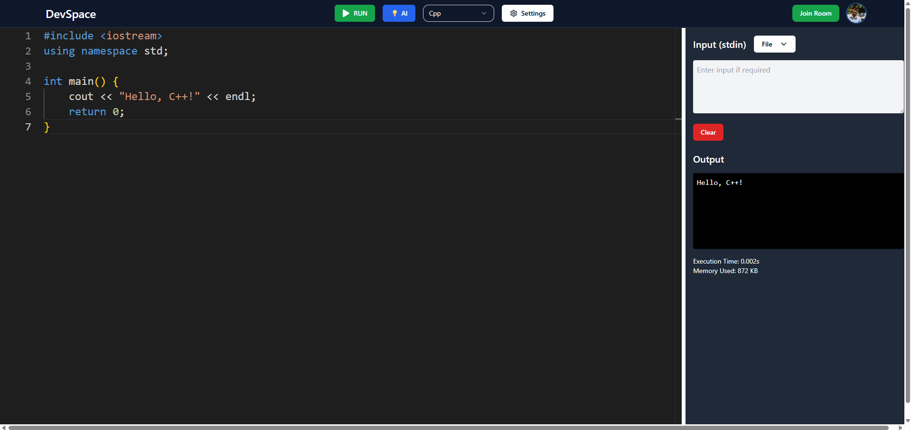
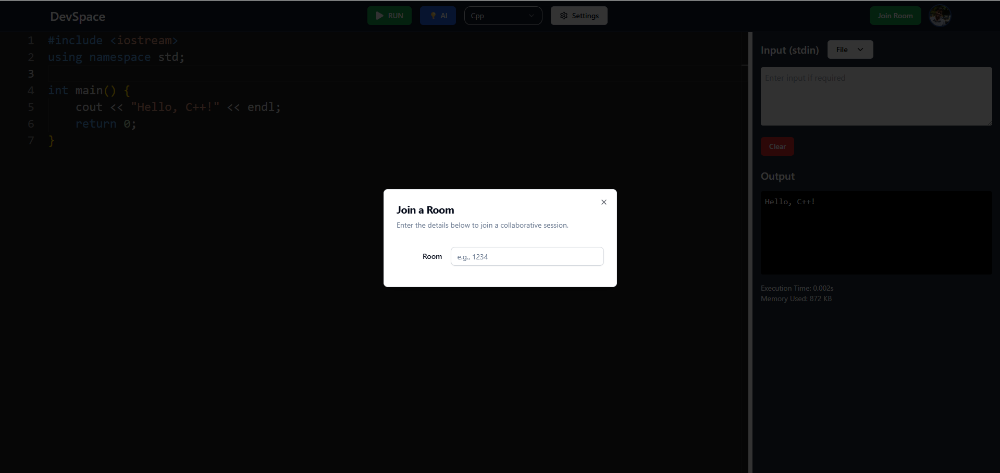
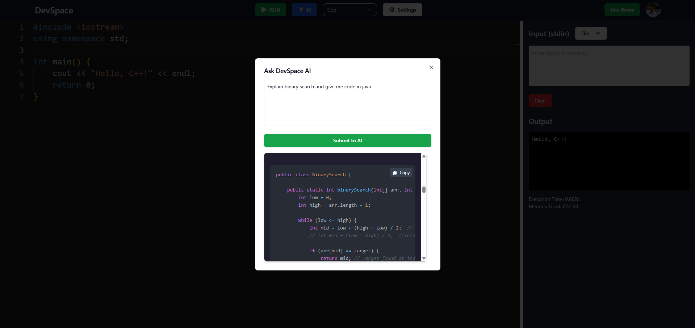

# 🚀 DevSpace - Real-Time Collaborative Code Editor

<div align="center">


[](https://nextjs.org/)
[](https://www.typescriptlang.org/)
[](https://microsoft.github.io/monaco-editor/)
[](https://github.com/websockets/ws)
[](https://tailwindcss.com/)

**A powerful, full-stack real-time collaborative code editor built with modern web technologies**

[🌐 Live Demo](https://dev-space-collaborative-code-editor-eight.vercel.app/dashboard/code-editor) • [📖 Documentation](https://your-docs-url.com) • [🐛 Report Bug](https://github.com/ajeetk7ev/DevSpace-Collaborative-CodeEditor/issues) • [✨ Request Feature](https://github.com/ajeetk7ev/DevSpace-Collaborative-CodeEditor/issues)

</div>

---

## ✨ What is DevSpace?

**DevSpace** is a cutting-edge, real-time collaborative code editor that brings developers together in a seamless coding environment. Think of it as a combination of **VS Code**, **Replit**, and **Google Docs** - but specifically designed for collaborative programming sessions.

### 🎯 Perfect for:
- **👥 Team Collaboration** - Code together in real-time with your team
- **🎓 Educational Sessions** - Teach programming with live code sharing
- **💼 Technical Interviews** - Conduct coding interviews with real-time collaboration
- **🚀 Hackathons** - Build projects together with instant code sharing
- **🔧 Pair Programming** - Work together on complex problems

---

## 🌟 Key Features

### 🧑‍💻 **Real-Time Collaboration**
- **Live Code Syncing** - See changes as they happen with WebSocket-powered synchronization
- **Multi-User Support** - Multiple developers can edit simultaneously
- **Room-Based System** - Create private rooms for focused collaboration
- **User Presence** - See who's online and what they're working on

### 🧠 **Powerful Code Editor**
- **Monaco Editor** - The same editor that powers VS Code
- **Syntax Highlighting** - Support for 10+ programming languages
- **IntelliSense** - Smart code completion and suggestions
- **Error Detection** - Real-time error highlighting and diagnostics
- **Customizable Themes** - Dark and light mode support

### 🚀 **Code Execution Engine**
- **Multi-Language Support** - JavaScript, TypeScript, Python, C++, Java, Go, and more
- **Judge0 Integration** - Secure code execution via Judge0 API
- **Custom Input Support** - Pass stdin data to your programs
- **Performance Metrics** - Execution time and memory usage tracking
- **Error Handling** - Detailed error messages with line numbers

### 🎨 **Modern UI/UX**
- **Responsive Design** - Works perfectly on desktop, tablet, and mobile
- **Split-Screen Layout** - Code editor and output side by side
- **Drag & Drop** - Resizable panels for optimal workflow
- **File Management** - Save, load, and share code files
- **AI Integration** - Built-in AI assistance for code generation

### 🔐 **Authentication & Security**
- **Clerk Authentication** - Secure user management
- **Room Privacy** - Private and public room options
- **Code Security** - Safe code execution environment
- **User Profiles** - Personalized experience

---

## 📸 Screenshots

<div align="center">

### 🏠 **Main Dashboard**


### 👥 **Collaborative Room**


### 🤖 **AI Assistant**


</div>

---

## 🛠️ Technology Stack

### **Frontend**
- **[Next.js 15](https://nextjs.org/)** - React framework with App Router
- **[React 19](https://react.dev/)** - Modern React with latest features
- **[TypeScript](https://www.typescriptlang.org/)** - Type-safe JavaScript
- **[TailwindCSS](https://tailwindcss.com/)** - Utility-first CSS framework
- **[Monaco Editor](https://microsoft.github.io/monaco-editor/)** - VS Code editor component

### **Backend & Real-time**
- **[WebSocket (ws)](https://github.com/websockets/ws)** - Real-time communication
- **[Express.js](https://expressjs.com/)** - Web server framework
- **[Node.js](https://nodejs.org/)** - JavaScript runtime

### **Database & Authentication**
- **[Prisma](https://www.prisma.io/)** - Modern database ORM
- **[Clerk](https://clerk.com/)** - Authentication and user management

### **APIs & Services**
- **[Judge0 API](https://rapidapi.com/judge0-official/api/judge0-ce/)** - Code execution service
- **[Google Gemini AI](https://ai.google.dev/)** - AI-powered code assistance

### **UI Components**
- **[Radix UI](https://www.radix-ui.com/)** - Accessible component primitives
- **[Lucide React](https://lucide.dev/)** - Beautiful icon library
- **[React Hot Toast](https://react-hot-toast.com/)** - Toast notifications

---

## 🚀 Quick Start

### Prerequisites

- **Node.js** 18+ 
- **npm** or **yarn**
- **Git**

### Installation

1. **Clone the repository**
   ```bash
   git clone https://github.com/ajeetk7ev/DevSpace-Collaborative-CodeEditor.git
   cd DevSpace-Collaborative-CodeEditor
   ```

2. **Install dependencies**
   ```bash
   # Install client dependencies
   cd client
   npm install
   
   # Install WebSocket server dependencies
   cd ../ws-server
   npm install
   ```

3. **Environment Setup**
   ```bash
   # Create environment files
   cp .env.example .env.local
   ```
   
   Add your environment variables:
   ```env
   # Clerk Authentication
   NEXT_PUBLIC_CLERK_PUBLISHABLE_KEY=your_clerk_key
   CLERK_SECRET_KEY=your_clerk_secret
   
   # Judge0 API
   RAPIDAPI_KEY=your_rapidapi_key
   
   # Google Gemini AI
   GOOGLE_API_KEY=your_google_api_key
   
   # Database
   DATABASE_URL=your_database_url
   ```

4. **Database Setup**
   ```bash
   # Generate Prisma client
   npx prisma generate
   
   # Run database migrations
   npx prisma db push
   ```

5. **Start the development servers**
   ```bash
   # Terminal 1: Start Next.js client
   cd client
   npm run dev
   
   # Terminal 2: Start WebSocket server
   cd ws-server
   npm run dev
   ```

6. **Open your browser**
   ```
   http://localhost:3000
   ```

---

## 📁 Project Structure

```
DevSpace-Collaborative-CodeEditor/
├── client/                          # Next.js frontend application
│   ├── app/                         # App Router pages
│   │   ├── api/                     # API routes
│   │   ├── dashboard/               # Dashboard pages
│   │   └── sign-in/                 # Authentication pages
│   ├── components/                  # React components
│   │   ├── header/                  # Header components
│   │   └── ui/                      # Reusable UI components
│   ├── lib/                         # Utility libraries
│   ├── prisma/                      # Database schema
│   └── utils/                       # Helper functions
├── ws-server/                       # WebSocket server
│   ├── src/                         # Server source code
│   └── dist/                        # Compiled JavaScript
└── public/                          # Static assets
    └── screenshots/                 # Project screenshots
```

---

## 🎮 Usage Guide

### **Creating a Room**
1. Click "Create Room" on the dashboard
2. Share the room ID with collaborators
3. Start coding together in real-time!

### **Joining a Room**
1. Click "Join Room" and enter the room ID
2. You'll be connected to the collaborative session
3. See other users' cursors and changes live

### **Running Code**
1. Select your programming language
2. Write your code in the editor
3. Click "Run" to execute your code
4. View output, errors, and performance metrics

### **Using AI Assistant**
1. Click the AI button in the header
2. Ask questions or request code generation
3. Get instant AI-powered assistance

---

## 🔧 Configuration

### **Supported Languages**
- JavaScript (Node.js)
- TypeScript
- Python 3
- C++
- Java
- Go
- Rust
- PHP
- Ruby
- C#

### **Editor Settings**
- Font size adjustment
- Theme selection (Dark/Light)
- Language-specific configurations
- Custom keybindings

---

## 🤝 Contributing

We welcome contributions! Please see our [Contributing Guidelines](CONTRIBUTING.md) for details.

### **Development Setup**
1. Fork the repository
2. Create a feature branch: `git checkout -b feature/amazing-feature`
3. Make your changes
4. Commit your changes: `git commit -m 'Add amazing feature'`
5. Push to the branch: `git push origin feature/amazing-feature`
6. Open a Pull Request

### **Code Style**
- Use TypeScript for type safety
- Follow ESLint configuration
- Write meaningful commit messages
- Add tests for new features

---


## 🙏 Acknowledgments

- **[Monaco Editor](https://microsoft.github.io/monaco-editor/)** - The amazing code editor
- **[Judge0](https://judge0.com/)** - Code execution service
- **[Clerk](https://clerk.com/)** - Authentication platform
- **[Next.js](https://nextjs.org/)** - React framework
- **[TailwindCSS](https://tailwindcss.com/)** - CSS framework

---


<div align="center">

**⭐ Star this repository if you found it helpful!**

Made with ❤️ by [Ajeet Kumar](https://github.com/ajeetk7ev)

</div>
